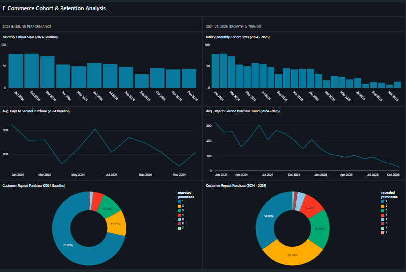

# E-Commerce Cohort & Retention Analysis Pipeline
> **A Databricks Medallion Architecture Project**

This project establishes an automated ELT (Extract, Load, Transform) data pipeline designed to analyze and predict customer retention patterns. By integrating historical and incremental sales data, the pipeline isolates a core business health metric: **How long does it take for a customer to return for a second purchase?**

---
## Dashboard Preview
[🔗 Click here to view the Interactive Dashboard](https://rb.gy/p7bymc)

---

## Key Business Insights
*   **Established Baseline:** Identified a baseline customer lifecycle of **248 days** for the 2024 cohort to complete their second-purchase journey, indicating a durable-goods purchasing pattern.
*   **Automated Scaling:** Successfully ingested and merged **1,000+ incremental transactions from 2025** into the historical pipeline without interrupting downstream reports.
*   **Loyalty Migration:** Uncovered a positive year-over-year migration trend, showing steady improvements in repeat purchase depth (retained customers making 2+, 3+, and 4+ follow-up purchases).

---

## Technical Architecture
To ensure data quality, scalability, and structural separation of concerns, the pipeline follows the **Medallion Lakehouse Architecture** implemented via Delta Lake tables:

[Bronze Layer (Raw)] ───► [Silver Layer (Cleaned)] ───► [Gold Layer (Business Metrics)]
    (CSV Ingestion)          (Schema Enforcement,       (Cohort Aggregations, Dims,
                             Null Truncation,            and Fact Retention Tables)
                             Case Standardization)

### 1. Bronze (Raw Ingestion)
*   Acts as the historical landing zone for raw transactional files.
*   Supports idempotent incremental file loads (including the 2025 dataset update) without duplicating legacy rows.

### 2. Silver (Data Cleaning & Validation)
*   Performs structural cleanup, drops corrupted records (`order_id IS NOT NULL`), and standardizes text strings (e.g., standardizing mixed-casing of cities and states using `INITCAP` to prevent filter fragmentation).

### 3. Gold (Reporting & Analytics)
*   **Dimensions:** Generates optimized dimensions (`dim_customers`, `dim_locations`) for downstream analytics.
*   **Facts:** Compiles the retention fact table (`gold_fact_retention`) utilizing analytical window functions (`LEAD`, `PARTITION BY`) to track exactly how many days elapse between sequential orders per user.

---

## Tooling & Tech Stack
*   **Platform:** Databricks (Single-Node Cluster)
*   **Languages:** SQL (Analytical Engine), PySpark (ELT Logic)
*   **Storage Format:** Delta Lake (for ACID transactions and time-travel capability)
*   **Visualizations:** Databricks Dashboards

---

## Visualizations Built & Tracked
The analytical dashboard monitors user behavior across both year-specific slices and rolling comparisons:

| Analysis Domain | Visualizations Created |
| :--- | :--- |
| **Cohort Size** | • Cohort Size Chart (2024 Only) • Cohort Size Chart (2024 & 2025 Comparison) |
| **Retention Curves** | • Retention to 2nd Purchase (2024 Only) • Retention to 2nd Purchase (2024 & 2025 Rolling) |
| **Purchase Depth** | • Repeat Purchase Depth (2024 Only) • Repeat Purchase Depth (2024 & 2025 Multi-buyer analysis) |

---

## 📂 Repository Contents
*   `📁 reports/`
    *   `Ecom Databricks Report.pdf` - Complete analytical summary and executive presentation.
*   `📁 src/`
    *   `ETL Project Notebook.ipynb` - Standard Jupyter Notebook export containing the pipeline code.
    *   `ETL Project Notebook.html` - Static HTML export showing fully rendered SQL code and tables.
    *   `ETL Project Notebook.dbc` - Source Databricks Archive file for easy cluster import.
*   `dashboard_results.png` - High-resolution layout of the 6-chart dashboard suite.

---------
